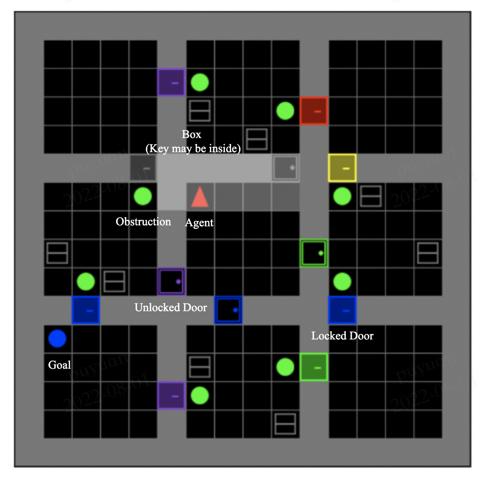
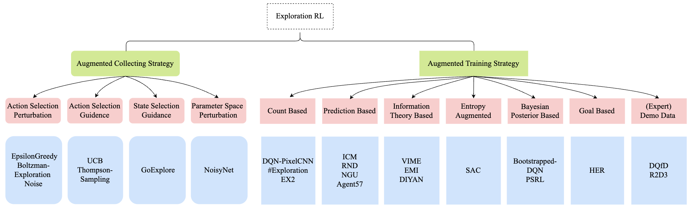

# Awesome Exploration Methods in Reinforcement Learning 

Here is a collection of research papers for **Exploration methods in Reinforcement Learning (ERL)**.
The repository will be continuously updated to track the frontier of ERL. 

Welcome to follow and star!

The balance of **exploration and exploitation** is one of the most central problems in reinforcement learning.
In order to give readers an intuitive feeling for exploration, we provide a visualization of a typical hard exploration environment in [MiniGrid](https://github.com/Farama-Foundation/gym-minigrid) below.
In this task, a series of actions to achieve the goal often require dozens or even hundreds of steps, in which the agent needs to fully explore different state-action spaces 
in order to learn the skills required to achieve the goal.

<center>
    
    <br>
    <figcaption align = "center"><b>A typical hard-exploration environment: MiniGrid-ObstructedMaze-Full-v0.</b></figcaption>
</center>

## Table of Contents

- [A Taxonomy of Exploration RL Methods](#a-taxonomy-of-exploration-rl-methods)
- [Papers](#papers)
  - [Classic Exploration RL Papers](#classic-exploration-rl-papers)
  <!-- - [NeurIPS 2022](#nips-2022) (**<font color="red">New!!!</font>**)  -->
  - [ICML 2022](#icml-2022)
  - [ICLR 2022](#iclr-2022)
  - [NeurIPS 2021](#neurips-2021)
- [Contributing](#contributing)


## A Taxonomy of Exploration RL Methods
In general, we can divide reinforcement learning process into two phases: *collect* phase and *train* phase.
In the *collect* phase, the agent chooses actions based on the current policy and then interacts with the environment to collect useful experience.
In the *train* phase, the agent uses the collected experience to update the current policy to obtain a better performing policy.

According to the phase the exploration component is explicitly applied, we simply divide the methods in `Exploration RL` into two main categories: `Augmented Collecting Strategy`, `Augmented Training Strategy`:

- `Augmented Collecting Strategy` represents a variety of different exploration strategies commonly used in the *collect* phase, which we further divide into *four* categories:
  - `Action Selection Perturbation`
  - `Action Selection Guidance`
  - `State Selection Guidance`
  - `Parameter Space Perturbation`

- `Augmented Training Strategy` represents a variety of different exploration strategies commonly used in the *train* phase, which we further divide into *seven* categories:
  - `Count Based`
  - `Prediction Based`
  - `Information Theory Based`
  - `Entropy Augmented`
  - `Bayesian Posterior Based`
  - `Goal Based`
  - `(Expert) Demo Data`

> Note that there may be overlap between these categories, and an algorithm may belong to several of them. 
> For other detailed survey on exploration methods in RL, you can refer to [Tianpei Yang et al](https://arxiv.org/abs/2109.06668) and [Susan Amin et al](https://arxiv.org/abs/2109.00157).


<center>
<figure>
    
    <br>
    <figcaption align = "center"><b>A non-exhaustive, but useful taxonomy of methods in Exploration RL.
    We provide some example methods for each of the different categories, shown in blue area above. </b></figcaption>
</figure>
</center>

Here are the links to the papers that appeared in the taxonomy:
>[1] [Go-Explore](https://www.nature.com/articles/s41586-020-03157-9): Adrien Ecoffet et al, 2021  
[2] [NoisyNet](https://openreview.net/pdf?id=rywHCPkAW), Meire Fortunato et al, 2018  
[3] [DQN-PixelCNN](https://arxiv.org/abs/1606.01868): Marc G. Bellemare et al, 2016  
[4] [#Exploration](http://papers.neurips.cc/paper/6868-exploration-a-study-of-count-based-exploration-for-deep-reinforcement-learning.pdf) Haoran Tang et al, 2017  
[5] [EX2](https://papers.nips.cc/paper/2017/file/1baff70e2669e8376347efd3a874a341-Paper.pdf): Justin Fu et al, 2017  
[6] [ICM](https://arxiv.org/abs/1705.05363): Deepak Pathak et al, 2018  
[7] [RND](https://arxiv.org/abs/1810.12894): Yuri Burda et al, 2018  
[8] [NGU](https://arxiv.org/abs/2002.06038): Adrià Puigdomènech Badia et al, 2020  
[9] [Agent57](https://arxiv.org/abs/2003.13350): Adrià Puigdomènech Badia et al, 2020  
[10] [VIME](https://arxiv.org/abs/1605.09674): Rein Houthooft et al, 2016    
[11] [EMI](https://openreview.net/forum?id=H1exf64KwH): Wang et al, 2019  
[12] [DIYAN](https://arxiv.org/abs/1802.06070): Benjamin Eysenbach et al, 2019  
[13] [SAC](https://arxiv.org/abs/1801.01290): Tuomas Haarnoja et al, 2018  
[14] [BootstrappedDQN](https://arxiv.org/abs/1602.04621): Ian Osband et al, 2016  
[15] [PSRL](https://arxiv.org/pdf/1306.0940.pdf): Ian Osband et al, 2013  
[16] [HER](https://arxiv.org/pdf/1707.01495.pdf) Marcin Andrychowicz et al, 2017  
[17] [DQfD](https://arxiv.org/abs/1704.03732): Todd Hester et al, 2018  
[18] [R2D3](https://arxiv.org/abs/1909.01387): Caglar Gulcehre et al, 2019  


## Papers

```
format:
- [title](paper link) (publisher, openreview score [if the score is public])
  - author1, author2, author3, ...
  - Key: key problems and insights
  - ExpEnv: experiment environments
```

### Classic Exploration RL Papers

- [Using Confidence Bounds for Exploitation-Exploration Trade-offs](https://www.jmlr.org/papers/volume3/auer02a/auer02a.pdf) *Journal of Machine Learning Research, 2002*
  - Peter Auer
  - Key: linear contextual bandits
  - ExpEnv: None

<!-- 
- [How can we define intrinsic motivation?](https://citeseerx.ist.psu.edu/viewdoc/download?doi=10.1.1.567.6524&rep=rep1&type=pdf) *Conf. on Epigenetic Robotics, 2008*
  - Pierre-Yves Oudeyer, Frederic Kaplan. 
  - Key: intrinsic motivation
  - ExpEnv: None
-->

- [A Contextual-Bandit Approach to Personalized News Article Recommendation](https://arxiv.org/abs/1003.0146) *WWW 2010*
  - Lihong Li, Wei Chu, John Langford, Robert E. Schapire
  - Key: LinUCB
  - ExpEnv: Yahoo! Front Page Today Module dataset

- [(More) Efficient Reinforcement Learning via Posterior Sampling](https://arxiv.org/pdf/1306.0940.pdf) *NeurIPS 2013*
  - Ian Osband, Benjamin Van Roy, Daniel Russo
  - Key:  prior distribution, posterior sampling
  - ExpEnv: RiverSwim

- [An empirical evaluation of thompson sampling](http://papers.nips.cc/paper/4321-an-empirical-evaluation-of-thompson-sampling.pdf) *NeurIPS 2011*
  - Olivier Chapelle, Lihong Li
  - Key: Thompson sampling, empirical results
  - ExpEnv: None

- [A Tutorial on Thompson Sampling](https://arxiv.org/pdf/1707.02038.pdf) *arxiv 2017*
  - Daniel J. Russo, Benjamin Van Roy, Abbas Kazerouni, Ian Osband, Zheng Wen
  - Key: Thompson sampling
  - ExpEnv: None

- [Unifying Count-Based Exploration and Intrinsic Motivation](https://arxiv.org/abs/1606.01868) *NeurIPS 2016*
  - Marc G. Bellemare, Sriram Srinivasan, Georg Ostrovski, Tom Schaul, David Saxton, Remi Munos
  - Key: intrinsic motivation, density models, pseudo-count
  - ExpEnv: [Atari](https://github.com/openai/gym)

- [Deep Exploration via Bootstrapped DQN](https://arxiv.org/abs/1602.04621) *NeurIPS 2016*
  - Ian Osband, Charles Blundell, Alexander Pritzel, Benjamin Van Roy
  - Key: temporally-extended (or deep) exploration, randomized value functions, bootstrapped DQN
  - ExpEnv: [Atari](https://github.com/openai/gym)

- [VIME: Variational information maximizing exploration](https://arxiv.org/abs/1605.09674) *NeurIPS 2016*
  - Rein Houthooft, Xi Chen, Yan Duan, John Schulman, Filip De Turck, Pieter Abbeel
  - Key: maximization of information gain, belief of environment dynamics, variational inference in Bayesian neural networks
  - ExpEnv: [rllab](https://github.com/rll/rllab)

- [\#Exploration: A Study of Count-Based Exploration for Deep Reinforcement Learning](http://papers.neurips.cc/paper/6868-exploration-a-study-of-count-based-exploration-for-deep-reinforcement-learning.pdf) *NeurIPS 2017*
  - Haoran Tang, Rein Houthooft, Davis Foote, Adam Stooke, Xi Chen, Yan Duan, John Schulman, Filip De Turck, Pieter Abbeel
  - Key: hash cont, intrinsic motivation
  - ExpEnv: [rllab](https://github.com/rll/rllab), [Atari](https://github.com/openai/gym)

- [EX2: Exploration with Exemplar Models for Deep Reinforcement Learning](https://papers.nips.cc/paper/2017/file/1baff70e2669e8376347efd3a874a341-Paper.pdf) *NeurIPS 2017*
   - Justin Fu, John D. Co-Reyes, Sergey Levine
   - Key: novelty detection, discriminatively trained exemplar models, implicit density estimation
   - ExpEnv: [VizDoom](https://github.com/mwydmuch/ViZDoom), [Atari](https://github.com/openai/gym)

- [Hindsight Experience Replay](https://arxiv.org/pdf/1707.01495.pdf) *NeurIPS 2017*
  - Marcin Andrychowicz, Filip Wolski, Alex Ray, Jonas Schneider, Rachel Fong, Peter Welinder, Bob McGrew, Josh Tobin, Pieter Abbeel, Wojciech Zaremba
  - Key: hindsight experience replay, implicit curriculum
  - ExpEnv: pushing, sliding, pick-and-place, physical robot

- [Curiosity-driven exploration by self-supervised prediction](https://arxiv.org/abs/1705.05363) *ICML 2017*
  - Deepak Pathak, Pulkit Agrawal, Alexei A. Efros, Trevor Darrell
  - Key: curiosity, self-supervised inverse dynamics model
  - ExpEnv: [VizDoom](https://github.com/mwydmuch/ViZDoom), [Super Mario Bros](https://supermario-game.com/)

- [Deep Q-learning from Demonstrations](https://arxiv.org/abs/1704.03732) *AAAI 2018*
  - Todd Hester, Matej Vecerik, Olivier Pietquin, Marc Lanctot, Tom Schaul, Bilal Piot, Dan Horgan, John Quan, Andrew Sendonaris, Gabriel Dulac-Arnold, Ian Osband, John Agapiou, Joel Z. Leibo, Audrunas Gruslys
  - Key: combining temporal difference updates with supervised classification of the demonstrator’s actions
  - ExpEnv: [Atari](https://github.com/openai/gym)

- [Noisy Networks For Exploration](https://openreview.net/pdf?id=rywHCPkAW) *ICLR 2018*
    - Meire Fortunato, Mohammad Gheshlaghi Azar, Bilal Piot, Jacob Menick, Matteo Hessel, Ian Osband, Alex Graves, Volodymyr Mnih, Remi Munos, Demis Hassabis, Olivier Pietquin, Charles Blundell, Shane Legg
    - Key: learned parametric noise
    - ExpEnv: [Atari](https://github.com/openai/gym)

- [Exploration by random network distillation](https://arxiv.org/abs/1810.12894) *ICLR 2018*
  - Yuri Burda, Harrison Edwards, Amos Storkey, Oleg Klimov
  - Key: random network distillation
  - ExpEnv: [Atari](https://github.com/openai/gym)

- [Soft Actor-Critic: Off-Policy Maximum Entropy Deep Reinforcement Learning with a Stochastic Actor](https://arxiv.org/abs/1801.01290)  *ICML 2018*
  - Tuomas Haarnoja, Aurick Zhou, Pieter Abbeel, Sergey Levine
  - Key: soft actor critic, maximum entropy, policy iteration
  - ExpEnv: [MuJoCo](https://github.com/openai/mujoco-py)
  
- [Large-Scale Study of Curiosity-Driven Learning](https://arxiv.org/abs/1808.04355)  *ICLR 2019*
  - Yuri Burda, Harri Edwards & Deepak Pathak, Amos Storkey, Trevor Darrell, Alexei A. Efros
  - Key: curiosity, prediction error, purely curiosity-driven learning, feature spaces
  - ExpEnv: [Atari](https://github.com/openai/gym), [Super Mario Bros](https://supermario-game.com/)

- [Diversity is all you need: Learning skills without a reward function](https://arxiv.org/abs/1802.06070) *ICLR 2019*
  - Benjamin Eysenbach, Abhishek Gupta, Julian Ibarz, Sergey Levine
  - Key: maximizing an information theoretic objective, unsupervised emergence of diverse skills
  - ExpEnv: [MuJoCo](https://github.com/openai/mujoco-py)
  
- [Episodic Curiosity through Reachability](https://arxiv.org/abs/1810.02274) *ICLR 2019*
  - Nikolay Savinov, Anton Raichuk, Rapha¨el Marinier, Damien Vincent, Marc Pollefeys, Timothy Lillicrap, Sylvain Gelly
  - Key: curiosity, episodic memory, how many environment steps it takes to reach the current observation
  - ExpEnv: [VizDoom](https://github.com/mwydmuch/ViZDoom), [DMLab](https://github.com/deepmind/lab), [MuJoCo](https://github.com/openai/mujoco-py)

- [Self-Supervised Exploration via Disagreement](https://arxiv.org/abs/1906.04161) *ICML 2019*
  - Deepak Pathak, Dhiraj Gandhi, Abhinav Gupta
  - Key:  ensemble of dynamics models, maximize the disagreement of those ensembles, differentiable manner
  - ExpEnv: Noisy MNIST, [Atari](https://github.com/openai/gym), [MuJoCo](https://github.com/openai/mujoco-py), [Unity](https://unity.com/products/machine-learning-agents), real robot

- [EMI: Exploration with Mutual Information](https://arxiv.org/abs/1810.01176) *ICML 2019*
  - Hyoungseok Kim, Jaekyeom Kim, Yeonwoo Jeong, Sergey Levine, Hyun Oh Song
  - Key: embedding representation of states and actions, forward prediction, mutual information
  - ExpEnv: [Atari](https://github.com/openai/gym), [MuJoCo](https://github.com/openai/mujoco-py)

- [Making Efficient Use of Demonstrations to Solve Hard Exploration Problems](https://arxiv.org/abs/1909.01387) *arxiv 2019*
    - Caglar Gulcehre, Tom Le Paine, Bobak Shahriari, Misha Denil, Matt Hoffman, Hubert Soyer, Richard Tanburn, Steven Kapturowski, Neil Rabinowitz, Duncan Williams, Gabriel Barth-Maron, Ziyu Wang, Nando de Freitas
    - Key: R2D2, makes efficient use of demonstrations, hard exploration problems
    - ExpEnv: [Atari](https://github.com/openai/gym)

- [Optimistic Exploration even with a Pessimistic Initialisation](http://www.cs.ox.ac.uk/people/shimon.whiteson/pubs/rashidiclr20.pdf) *ICLR 2020*
    - Tabish Rashid, Bei Peng, Wendelin Böhmer, Shimon Whiteson
    - Key: pessimistically initialised Q-values, count-derived bonuses, optimism during both action selection and bootstrapping
    - ExpEnv: randomised chain, Maze, [Montezuma’s Revenge](https://github.com/openai/gym)

- [RIDE: Rewarding Impact-Driven Exploration for Procedurally-Generated Environments](https://openreview.net/pdf?id=rkg-TJBFPB) *ICLR 2020*
    - Roberta Raileanu, Tim Rocktäschel
    - Key: lead to significant changes in its learned state representation
    - ExpEnv: [MiniGrid](https://github.com/Farama-Foundation/gym-minigrid)

- [Never give up: Learning directed exploration strategies](https://arxiv.org/abs/2002.06038) *ICLR 2020*
  - Adrià Puigdomènech Badia, Pablo Sprechmann, Alex Vitvitskyi, Daniel Guo, Bilal Piot, Steven Kapturowski, Olivier Tieleman, Martín Arjovsky, Alexander Pritzel, Andew Bolt, Charles Blundell
  - Key:  ICM+RND, different degrees of exploration/exploitation
  - ExpEnv: [Atari](https://github.com/openai/gym)
  
- [Agent57: Outperforming the atari human benchmark](https://arxiv.org/abs/2003.13350) *ICML 2020* 
  - Adrià Puigdomènech Badia, Bilal Piot, Steven Kapturowski, Pablo Sprechmann, Alex Vitvitskyi, Daniel Guo, Charles Blundell
  - Key:  parameterizes a family of policies, adaptive mechanism, state-action value function parameterization
  - ExpEnv: [Atari](https://github.com/openai/gym), [roboschool](https://github.com/openai/roboschool)

- [Neural Contextual Bandits with UCB-based Exploration](https://arxiv.org/pdf/1911.04462.pdf) *ICML 2020*
  - Dongruo Zhou, Lihong Li, Quanquan Gu
  - Key:  stochastic contextual bandit,  neural network-based random feature, near-optimal regret guarantee
  - ExpEnv: contextual bandits, UCI Machine Learning Repository, [MNIST](http://yann.lecun.com/exdb/mnist/)

- [Rank the Episodes: A Simple Approach for Exploration in Procedurally-Generated Environments](https://arxiv.org/abs/2101.08152) *ICLR 2021*
  - Daochen Zha, Wenye Ma, Lei Yuan, Xia Hu, Ji Liu
  - Key: procedurally-generated environments, episodic exploration score from both per-episode and long-term views
  - ExpEnv: [MiniGrid](https://github.com/Farama-Foundation/gym-minigrid), MiniWorld, [MuJoCo](https://github.com/openai/mujoco-py)

- [First return then explore](https://www.nature.com/articles/s41586-020-03157-9) *Nature 2021*
  - Adrien Ecoffet, Joost Huizinga, Joel Lehman, Kenneth O. Stanley, Jeff Clune
  - Key:  detachment and derailment, remembering states, returning to them, and exploring from them
  - ExpEnv: [Atari](https://github.com/openai/gym), pick-and-place robotics task
  

### ICML 2022

- [From Dirichlet to Rubin: Optimistic Exploration in RL without Bonuses](https://arxiv.org/pdf/2205.07704) (Oral)
  - Daniil Tiapkin, Denis Belomestny, Eric Moulines, Alexey Naumov, Sergey Samsonov, Yunhao Tang, Michal Valko, Pierre Menard
  - Key: Bayes-UCBVI, regret bound, quantile of a Q-value function posterior, anticoncentration inequality for a Dirichlet weighted sum
  - ExpEnv: simple tabular grid-world env, [Atari](https://github.com/openai/gym)

- [The Importance of Non-Markovianity in Maximum State Entropy Exploration](https://arxiv.org/pdf/2202.03060) (Oral)
  - Mirco Mutti, Riccardo De Santi, Marcello Restelli
  - Key: maximum state entropy exploration, non-Markovianity, finite-sample regime
  - ExpEnv: 3State, River Swim

- [Phasic Self-Imitative Reduction for Sparse-Reward Goal-Conditioned Reinforcement Learning](https://arxiv.org/abs/2206.12030) (Spotlight) 
  - Yunfei Li, Tian Gao, Jiaqi Yang, Huazhe Xu, Yi Wu
  - Key:  sparse-reward goal-conditioned, RL/SL phasic, task reduction
  - ExpEnv: Sawyer Push, [Ant Maze](https://github.com/deepmind/dm_control), Stacking

- [Thompson Sampling for (Combinatorial) Pure Exploration](https://arxiv.org/abs/2206.09150) (Spotlight)
  - Siwei Wang, Jun Zhu
  - Key: combinatorial pure exploration, Thompson Sampling, lower complexity
  - ExpEnv: combinatorial [multi-armed bandit](https://en.wikipedia.org/wiki/Multi-armed_bandit)

- [Near-Optimal Algorithms for Autonomous Exploration and Multi-Goal Stochastic Shortest Path](https://arxiv.org/pdf/2205.10729.pdf) (Spotlight)
  - Haoyuan Cai, Tengyu Ma, Simon Du
  - Key: incremental autonomous exploration, stronger sample complexity bounds, multi-goal stochastic shortest path
  - ExpEnv: hard MDP

- [Safe Exploration for Efficient Policy Evaluation and Comparison](https://arxiv.org/pdf/2202.13234.pdf) (Spotlight)
  - Runzhe Wan, Branislav Kveton, Rui Song
  - Key:  efficient and safe data collection for bandit policy evaluation.
  - ExpEnv: [multi-armed bandit](https://en.wikipedia.org/wiki/Multi-armed_bandit), contextual multi-armed bandit, linear bandits


### ICLR 2022

- [The Information Geometry of Unsupervised Reinforcement Learning](https://openreview.net/pdf?id=3wU2UX0voE) (Oral: 8, 8, 8)
   - Benjamin Eysenbach, Ruslan Salakhutdinov, Sergey Levine
   - Key: unsupervised skill discovery, mutual information objective, adversarially-chosen reward functions
   - ExpEnv: None
   
- [When should agents explore?](https://arxiv.org/abs/2108.11811) (Spotlight: 8, 8, 6, 6)
  - Miruna Pislar, David Szepesvari, Georg Ostrovski, Diana Borsa, Tom Schaul
  - Key: mode-switching, non-monolithic exploration, intra-episodic exploration
  - ExpEnv: [Atari](https://github.com/openai/gym)

- [Learning more skills through optimistic exploration](https://openreview.net/pdf?id=cU8rknuhxcDJ) (Spotlight: 8, 8, 8, 6)
  - DJ Strouse, Kate Baumli, David Warde-Farley, Vlad Mnih, Steven Hansen
  - Key: discriminator disagreement intrinsic reward, information gain auxiliary objective
  - ExpEnv: tabular grid world, [Atari](https://github.com/openai/gym)

- [Learning Long-Term Reward Redistribution via Randomized Return Decomposition](https://arxiv.org/abs/2111.13485) (Spotlight: 8, 8, 8, 5)
  - Zhizhou Ren, Ruihan Guo, Yuan Zhou, Jian Peng
  - Key: sparse and delayed rewards, randomized return decomposition
  - ExpEnv: [MuJoCo](https://github.com/openai/mujoco-py)

- [Reinforcement Learning with Sparse Rewards using Guidance from Offline Demonstration](https://openreview.net/pdf?id=YJ1WzgMVsMt) (Spotlight: 8, 8, 8, 6, 6)
  - Desik Rengarajan, Gargi Vaidya, Akshay Sarvesh, Dileep Kalathil, Srinivas Shakkottai
  - Key: learning online with guidance offline
  - ExpEnv: [MuJoCo](https://github.com/openai/mujoco-py), [TurtleBot](https://www.turtlebot.com/) (Waypoint tracking, Obstacle avoidance)

- [Generative Planning for Temporally Coordinated Exploration in Reinforcement Learning](https://openreview.net/pdf?id=YZHES8wIdE) (Spotlight: 8, 8, 8, 6)
  - Haichao Zhang, Wei Xu, Haonan Yu
  - Key: generative planning method, temporally coordinated exploration, crude initial plan
  - ExpEnv: [classic continuous control env](https://github.com/openai/gym), [CARLA](https://github.com/carla-simulator/carla)

- [Learning Altruistic Behaviours in Reinforcement Learning without External Rewards](https://arxiv.org/abs/2107.09598) (Spotlight: 8, 8, 6, 6)
  - Tim Franzmeyer, Mateusz Malinowski, João F. Henriques
  - Key: altruistic behaviour, task-agnostic
  - ExpEnv: grid world env, [foraging](https://github.com/semitable/lb-foraging), [multi-agent tag](https://github.com/Farama-Foundation/PettingZoo/tree/master/pettingzoo/mpe/simple_tag)

- [Anti-Concentrated Confidence Bonuses for Scalable Exploration](https://arxiv.org/abs/2110.11202) (Poster: 8, 6, 5)
  - Jordan T. Ash, Cyril Zhang, Surbhi Goel, Akshay Krishnamurthy, Sham Kakade
  - Key: anti-concentrated confidence bounds, elliptical bonus
  - ExpEnv: [multi-armed bandit](https://en.wikipedia.org/wiki/Multi-armed_bandit), [Atari](https://github.com/openai/gym)

- [Lipschitz-constrained Unsupervised Skill Discovery](https://arxiv.org/abs/2202.00914) (Poster: 8, 6, 6, 6)
  - Seohong Park, Jongwook Choi, Jaekyeom Kim, Honglak Lee, Gunhee Kim
  - Key: unsupervised skill discovery, Lipschitz-constrained
  - ExpEnv: [MuJoCo](https://github.com/openai/mujoco-py)
  
- [LIGS: Learnable Intrinsic-Reward Generation Selection for Multi-Agent Learning](https://arxiv.org/pdf/2112.02618.pdf) (Poster: 8, 6, 5, 5)
  - David Henry Mguni, Taher Jafferjee, Jianhong Wang, Nicolas Perez-Nieves, Oliver Slumbers, Feifei Tong, Yang Li, Jiangcheng Zhu, Yaodong Yang, Jun Wang
  - Key: multi-agent, coordinated exploration and behaviour, learnable intrinsic-reward generation selection, switching controls
  - ExpEnv: [foraging](https://github.com/semitable/lb-foraging), [StarCraft II](https://github.com/oxwhirl/smac)

- [Multi-Stage Episodic Control for Strategic Exploration in Text Games](https://openreview.net/forum?id=Ek7PSN7Y77z) (Spotlight: 8, 8, 6, 6)
  - Jens Tuyls, Shunyu Yao, Sham M. Kakade, Karthik R Narasimhan
  - Key: multi-stage approach, policy decomposition
  - ExpEnv: [Jericho](https://github.com/microsoft/jericho)

- [On the Convergence of the Monte Carlo Exploring Starts Algorithm for Reinforcement Learning](https://openreview.net/forum?id=JzNB0eA2-M4) (Poster: 8, 8, 5, 5)
  - Che Wang, Shuhan Yuan, Kai Shao, Keith Ross
  - Key: Monte Carlo exploring starts, optimal policy feed-forward MDPs
  - ExpEnv: [blackjack](https://github.com/topics/blackjack-game), cliff Walking
  

### NeurIPS 2021

- [Interesting Object, Curious Agent: Learning Task-Agnostic Exploration](https://arxiv.org/abs/2111.13119) (Oral: 9, 8, 8, 8)
  - Simone Parisi, Victoria Dean,Deepak Pathak, Abhinav Gupta
  - Key: task-agnostic exploration, agent-centric component, environment-centric component
  - ExpEnv: [MiniGrid](https://github.com/Farama-Foundation/gym-minigrid), [Habitat](https://github.com/facebookresearch/habitat-sim)

- [Tactical Optimism and Pessimism for Deep Reinforcement Learning](https://arxiv.org/pdf/2102.03765.pdf) (Poster: 9, 7, 6, 6) 
  - Ted Moskovitz, Jack Parker-Holder, Aldo Pacchiano, Michael Arbel, Michael Jordan
  - Key: Tactical Optimistic and Pessimistic estimation, multi-arm bandit problem
  - ExpEnv: [MuJoCo](https://github.com/openai/mujoco-py)

- [Which Mutual-Information Representation Learning Objectives are Sufficient for Control?](https://arxiv.org/pdf/2106.07278.pdf) (Poster: 7, 6, 6, 5) 
  - Kate Rakelly, Abhishek Gupta,Carlos Florensa, Sergey Levine
  - Key: mutual information objectives, sufficiency of a state representation
  - ExpEnv: catcher, catcher-grip

- [On the Theory of Reinforcement Learning with Once-per-Episode Feedback](https://openreview.net/pdf?id=-uFBxNwRHa2) (Poster: 6, 5, 5, 4) 
  - Niladri S. Chatterji, Aldo Pacchiano, Peter L. Bartlett, Michael I. Jordan
  - Key: binary feedback, sublinear regret
  - ExpEnv: None

- [MADE: Exploration via Maximizing Deviation from Explored Regions](https://openreview.net/pdf?id=DTVfEJIL3DB) (Poster: 7, 7, 6, 5)
  - Tianjun Zhang, Paria Rashidinejad, Jiantao Jiao, Yuandong Tian, Joseph Gonzalez, Stuart Russell
  - Key: maximizing deviation from the explored regions, intrinsic reward
  - ExpEnv: [MiniGrid](https://github.com/Farama-Foundation/gym-minigrid), [DeepMind Control Suite](https://github.com/deepmind/dm_control)

- [Adversarial Intrinsic Motivation for Reinforcement Learning](https://arxiv.org/pdf/2105.13345.pdf) (Poster: 7, 7, 6) 
  - Ishan Durugkar, Mauricio Tec, Scott Niekum, Peter Stone
  - Key: the Wasserstein-1 distance, goal-conditioned, quasimetric, adversarial intrinsic motivation
  - ExpEnv: Grid World, Fetch Robot (based on [MuJoCo](https://github.com/openai/mujoco-py))

- [Information Directed Reward Learning for Reinforcement Learning](https://arxiv.org/pdf/2102.12466.pdf) (Poster: 9, 8, 7, 6) 
  - David Lindner, Matteo Turchetta, Sebastian Tschiatschek, Kamil Ciosek, Andreas Krause
  - Key: expert queries, Bayesian model of the reward, maximize the information gain
  - ExpEnv: [MuJoCo](https://github.com/openai/mujoco-py)

- [Dynamic Bottleneck for Robust Self-Supervised Exploration](https://openreview.net/pdf?id=-t6TeG3A6Do) (Poster: 8, 6, 6, 6)
  - Chenjia Bai, Lingxiao Wang, Lei Han, Animesh Garg, Jianye Hao, Peng Liu, Zhaoran Wang
  - Key: Dynamic Bottleneck, information gain
  - ExpEnv: [Atari](https://github.com/openai/gym)

- [Hierarchical Skills for Efficient Exploration](https://arxiv.org/abs/2110.10809) (Poster: 7, 6, 6, 6)
  - Jonas Gehring, Gabriel Synnaeve, Andreas Krause, Nicolas Usunier
  - Key: hierarchical skill learning, balance between generality and specificity, skills of varying complexity
  - ExpEnv: Hurdles, Limbo, Stairs, GoalWall PoleBalance (based on [MuJoCo](https://github.com/openai/mujoco-py))

- [Exploration-Exploitation in Multi-Agent Competition: Convergence with Bounded Rationality](https://openreview.net/pdf?id=OSLVL-tIBei) (spotlight: 8, 6, 6)
  - Stefanos Leonardos, Georgios Piliouras, Kelly Spendlove
  - Key: competitive multi-agent, balance between game rewards and exploration costs, unique quantal-response equilibrium
  - ExpEnv: Two-Agent Weighted Zero-Sum Games

- [NovelD: A Simple yet Effective Exploration Criterion](https://proceedings.neurips.cc/paper/2021/file/d428d070622e0f4363fceae11f4a3576-Paper.pdf) (Poster: 7, 6, 6, 6)
  - Tianjun Zhang, Huazhe Xu, Xiaolong Wang, Yi Wu, Kurt Keutzer, Joseph E. Gonzalez, Yuandong Tian
  - Key: weighting every novel area approximately equally
  - ExpEnv: [MiniGrid](https://github.com/Farama-Foundation/gym-minigrid), [NetHack](https://github.com/NetHack/NetHack), [Atari](https://github.com/openai/gym)

- [Episodic Multi-agent Reinforcement Learning with Curiosity-driven Exploration](https://arxiv.org/pdf/2111.11032.pdf) (Poster: 7, 6, 6, 5)
  - Lulu Zheng, Jiarui Chen, Jianhao Wang, Jiamin He, Yujing Hu, Yingfeng Chen, Changjie Fan, Yang Gao, Chongjie Zhang
  - Key: episodic Multi-agent, curiosity-driven exploration, prediction errors, episodic memory
  - ExpEnv: [Predator-Prey](https://github.com/Farama-Foundation/PettingZoo), [StarCraft II](https://github.com/oxwhirl/smac)

- [Learning Diverse Policies in MOBA Games via Macro-Goals](https://proceedings.neurips.cc/paper/2021/file/86dba86754c0ad93997a11fa947d97b2-Paper.pdf) (Poster: 7, 6, 5, 5)
  - Yiming Gao, Bei Shi, Xueying Du, Liang Wang, Guangwei Chen, Zhenjie Lian, Fuhao Qiu, Guonan Han, Weixuan Wang, Deheng Ye, Qiang Fu, Wei Yang, Lanxiao Huang
  - Key: MOBA-game, policy diversity, Macro-Goals Guided framework, Meta-Controller, human demonstrations
  - ExpEnv: [honor of kings](https://www.honorofkings.com/)

- [CIC: Contrastive Intrinsic Control for Unsupervised Skill Discovery](https://openreview.net/pdf/f6d399de0d94e1c67c8b556e4ab6c0ee5b77a10f.pdf) (not accepted now: 8, 8, 6, 3)
    - Michael Laskin, Hao Liu, Xue Bin Peng, Denis Yarats, Aravind Rajeswaran, Pieter Abbeel
    - Key: decomposition of the mutual information, particle estimator, contrastive learning
    - ExpEnv: [URLB](https://openreview.net/pdf?id=lwrPkQP_is)

## Contributing
Our purpose is to provide a starting paper guide to who are interested in exploration methods in RL.
If you are interested in contributing, please refer to [HERE](CONTRIBUTING.md) for instructions in contribution.


## License
Awesome Exploration RL is released under the Apache 2.0 license.
